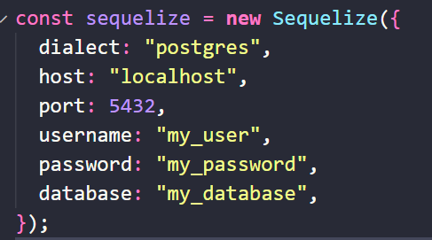
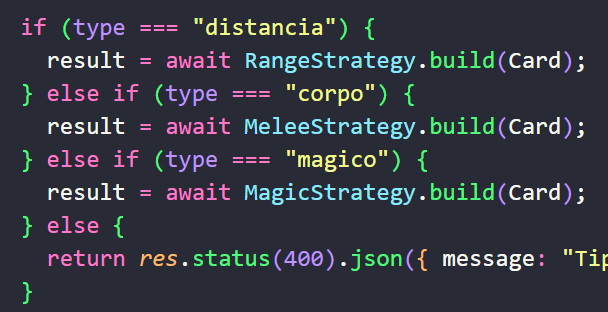
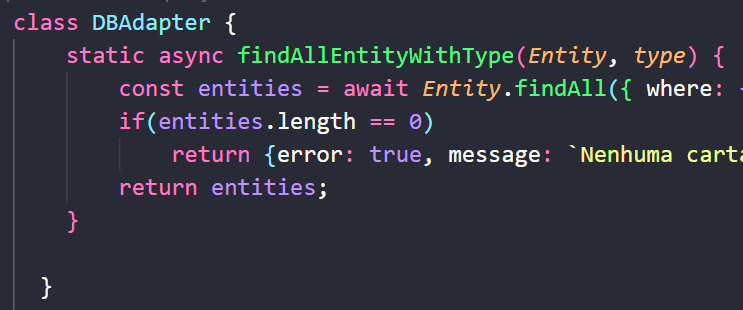
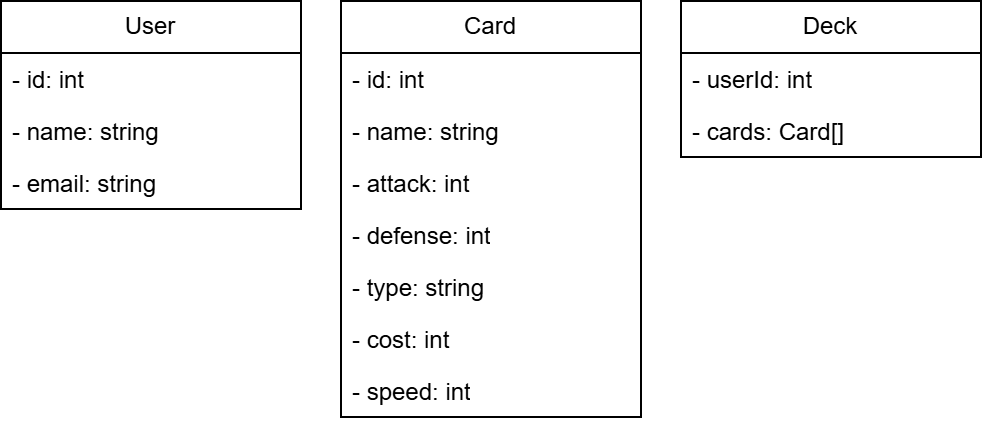
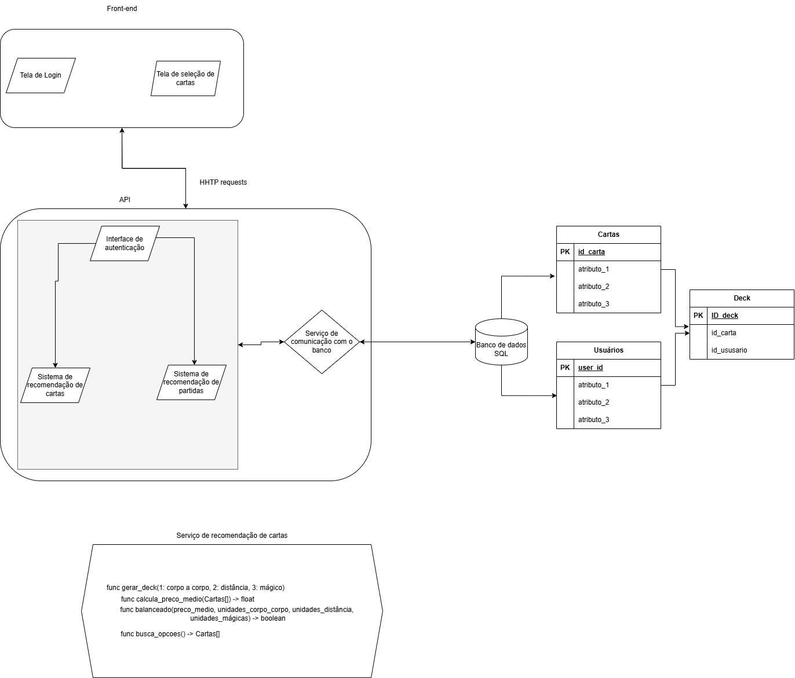

# Recomendação de cartas

## Design Patterns usados no projeto:

### Singleton



### Strategy



### Adapter




Este projeto foi desenvolvido para a disciplina de **Arquitetura de Software**. O objetivo é criar um sistema de recomendação de cartas para um jogo, utilizando o padrão de arquitetura **MVC** (Model-View-Controller) com **Node.js** e **Express**.



## Estrutura do Projeto

O projeto segue a estrutura **MVC**, dividindo a aplicação em três componentes principais:

- **Model**: Responsável pela lógica de dados e interação com o banco de dados.
- **View**: Responsável pela interface do usuário e apresentação dos dados.
- **Controller**: Responsável por receber as requisições do usuário, processar os dados através do Model e retornar a resposta adequada através da View.

## Endpoints:

- /generateDeck (POST):
    - Um POST request com o tipo de cartas desejados que retorna um conjunto de cartas selecionados (um deck)

- /createDeck (POST):
    - Um POST request com as cartas desejadas em um deck. Cria um deck pronto no banco de dados

- /deckForm (GET):
    - Um GET request que retorna uma página HTML com opções de criação e geração de decks por interface

## Tecnologias Utilizadas

- **Node.js**: Plataforma de desenvolvimento.
- **Express**: Framework para Node.js.
- **PostgreSQL**: Banco de dados relacional para armazenamento das cartas e recomendações.

## Instalação

1. Clone o repositório:
   ```bash
   git clone https://github.com/InatelS203/RecomedacaoCartas.git

2. Navegue até o diretório do projeto:
   ```bash
   cd RecomendacaoCartas
   ``` 

3. Instale as dependências:
    ```bash
    npm install
    ```

4. Configure as variáveis de ambiente no arquivo .env:
    ```bash
    PORT=3000
    DB_HOST=localhost
    DB_USER=seu-usuario
    DB_PASSWORD=sua-senha
    DB_NAME=nome-do-banco
    ```


## Estrutura de pastas

- ```src/controller:```
    - deck.controller: faz um CRUD com o model para manipular as cartas no banco de dados.
    - Função generateDeck, que é a principal utilizada. Usada para a geração do deck de cartas.

- ```src/models:``` 
    - utiliza um ORM (sequelize) pra fazer as operações com o banco de dados. Abstrai a linguagem SQL.

- ```src/views:```
    - deckForm.ejs: é um frontend que é entregue para o cliente, em que ele pode testar a geração de decks.